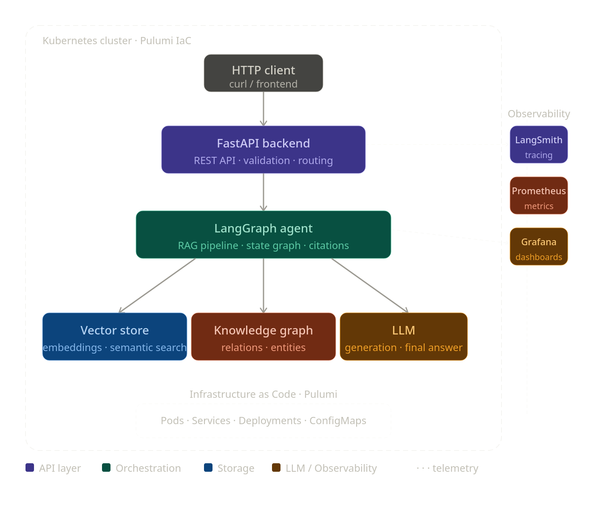
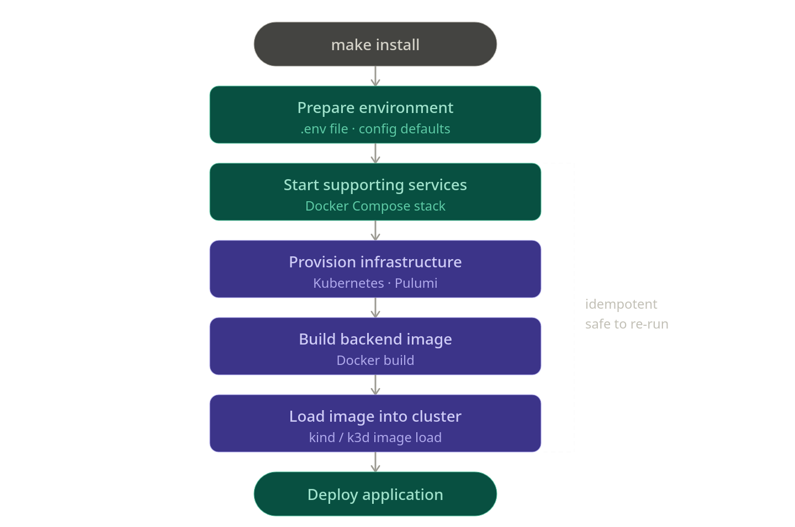

# Arch Review

Arch Review is a reproducible project for building, deploying, and observing a cloud-native LLM application on Kubernetes.

The goal is to implement a FastAPI backend orchestrated with LangGraph that can answer questions over technical documentation using Retrieval-Augmented Generation. The system is intended to combine vector search, a small knowledge graph, source citations, and operational observability.



The project is designed to run on Kubernetes, with infrastructure managed through Pulumi and observability through tools such as LangSmith, Prometheus, and Grafana. The emphasis is architectural clarity: a small, explainable RAG platform that demonstrates deployment, infrastructure as code, tracing, metrics, and documented trade-offs.

## Quick Start

```bash
make install
```

This command prepares the environment file, starts the supporting services, provisions the Kubernetes and Pulumi resources, builds the backend image, loads it into the cluster, and deploys the application. It is idempotent, so running it multiple times should converge the environment without breaking an existing setup.



## Progress Log

This section tracks the main implementation milestones and architectural decisions as the project evolves.

### 2026-04-26

- Added a FastAPI backend skeleton under `app/` and configured Docker Compose to build and run the backend image with `uv`.
- Centralized environment configuration in `.env`, with `env.example` documenting the expected variables for Kubernetes, the backend image, Pulumi, state management, and cloud-compatible credentials.
- Added idempotent provisioning scripts for Kubernetes infrastructure, Pulumi state management, and the Pulumi `dev` stack under `infra/`.
- Updated the Makefile to orchestrate provisioning steps through scripts instead of embedding operational logic directly in make targets.
- Added Pulumi resources to deploy the FastAPI backend on Kubernetes, including namespace, deployment, service, ingress, and Traefik-based routing.
- Added Makefile targets to build the backend image, load it into the Kubernetes cluster, and deploy the application through Pulumi.
- Verified that the backend is reachable at `http://arch-review.local:8000`.
- Established a stable delivery loop that supports small, incremental changes with fast feedback through image build, cluster load, and Pulumi deployment.
- Added pgvector and Neo4j as RAG data services, available both in Docker Compose for development and in Kubernetes through Pulumi-managed resources.
- Refactored infrastructure configuration so stack-specific values such as service names, ports, storage sizes, images, and Traefik settings are defined in `Pulumi.<stack>.yaml`.
- Added a non-interactive `make install` bootstrap path for quickly reproducing the full environment from a fresh checkout.
- Designed domain models for the intake bounded context following DDD, using Python dataclasses. Value objects: `Source`, `ProcessingStatus`, `ChunkStatus`, `Metadata`. Entities: `Document`, `DocumentChunk`. Repository protocols: `DocumentRepository`, `ChunkRepository`.
- Added `pydantic-settings` for database configuration (`app/settings.py`), loading `PGVECTOR` and `NEO4J` connection parameters from `.env`.
- Installed `psycopg[binary,pool]` for async PostgreSQL access.
- Implemented in-memory (`InMemoryDocumentRepository`, `InMemoryChunkRepository`) and PostgreSQL (`PostgresDocumentRepository`, `PostgresChunkRepository`) repository variants under `app/intake/infrastructure/persistence/`.
- Added 12 integration tests in `tests/integration/test_repositories.py` that run the same scenarios against both implementations, verifying save, find, upsert, delete, batch save, status filtering, and cascade delete. Postgres tables are cleaned up after the test session.
- Added `make test` to run tests inside Docker.
- Added `ruff` and `ty` (Astral's Rust-based Python type checker) as dev dependencies, with `make ruff`, `make ty`, and `make lint` targets. The `ty` target runs in strict mode and excludes `infra/`.
- Added `dbmate` service in Docker Compose for database migration management. Initial migration creates `documents` and `chunks` tables with vector extension, foreign keys, and indexes. Use `make dbmate` to apply pending migrations.
- Added `.github/workflows/ci.yml` with lint (`make ruff`), type checking (`make ty`), and test (`make test`) steps running on push/PR to `main`.
