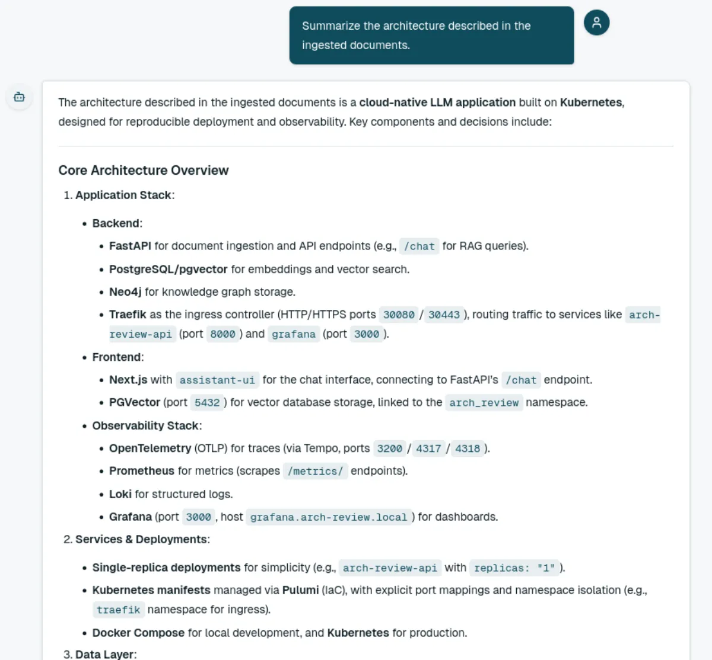
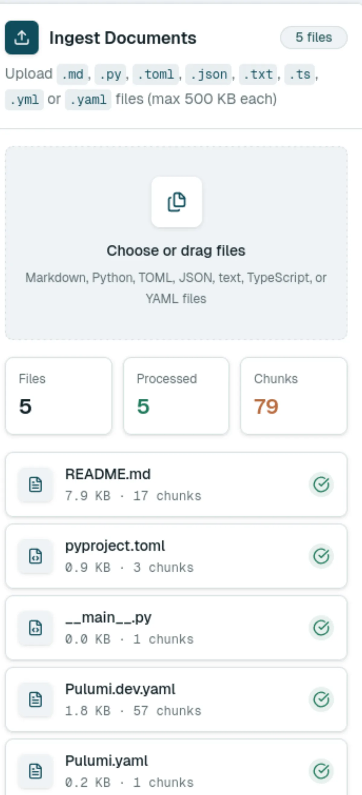
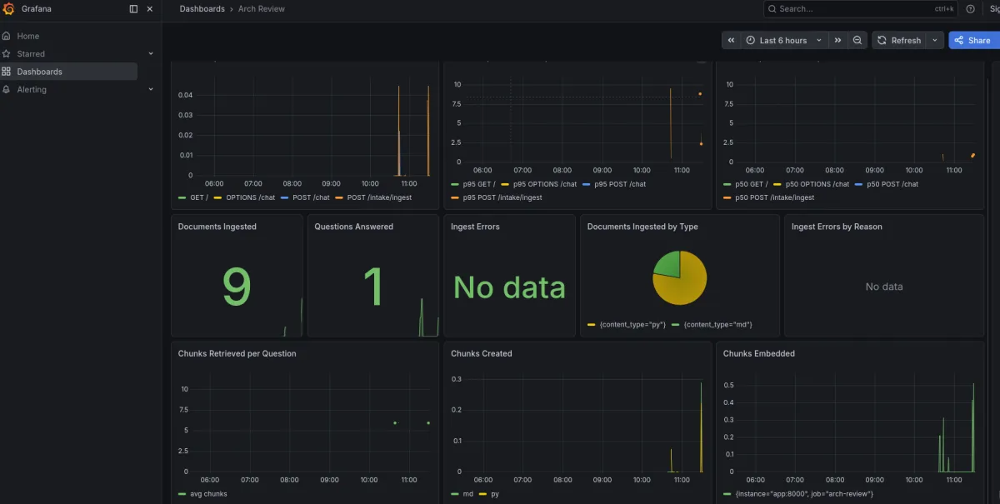

# Arch Review

Arch Review is a cloud-native architecture review assistant for technical documentation and source code.

It solves a common engineering problem: architecture knowledge is usually spread across README files, Pulumi configuration, Kubernetes manifests, source code, migration files, and operational dashboards. That makes it difficult to answer simple but important questions such as "how is this system deployed?", "which services store the retrieval context?", or "what trade-offs does this architecture make?" without manually reading many files.



This project turns those technical sources into a queryable knowledge base. Users upload Markdown, Python, TypeScript, YAML, TOML, JSON, or text files; the backend validates and chunks them; the chunks are enriched with embeddings and graph context; and the chat interface answers questions using retrieval-augmented generation with source citations.

## Product Surface

The application currently provides two main workflows:

- **Document intake**: upload technical files from the browser, validate them, split them into retrieval-friendly chunks, generate embeddings, persist the documents and chunks in PostgreSQL with pgvector, and mirror chunk nodes into Neo4j.
- **Architecture review chat**: ask questions about the ingested material through a Next.js chat UI. The frontend calls the FastAPI `/chat` endpoint, which retrieves relevant chunks and asks the LLM to answer only from the available evidence.

Local URLs:

| Service | URL |
| --- | --- |
| Frontend | `http://localhost:3000` |
| Backend API | `http://localhost:8000` |
| Grafana | `http://localhost:3001` |
| Prometheus | `http://localhost:9090` |
| Loki | `http://localhost:3100` |

## Architecture

Arch Review is organized as a small RAG platform with explicit application boundaries:

1. The **Next.js frontend** provides a two-panel workspace: document intake on one side and the review chat on the other.
2. The **FastAPI backend** exposes ingestion and chat endpoints.
3. The **intake bounded context** validates files, creates domain `Document` and `DocumentChunk` entities, applies language-aware chunking, optionally builds hierarchical RAPTOR summaries, generates embeddings, writes relational/vector records, and creates graph nodes.
4. The **chat bounded context** embeds the user question, retrieves similar chunks from pgvector, builds an evidence-constrained prompt, and returns an answer with structured citations.
5. The **data layer** combines PostgreSQL/pgvector for durable document storage and semantic search with Neo4j for graph-oriented document relationships.
6. The **operations layer** ships tracing, metrics, logs, dashboards, infrastructure automation, and Kubernetes deployment resources as part of the project.

At runtime, the main request flow looks like this:

```text
Browser
  -> Next.js workspace
  -> FastAPI routers
  -> Application use cases
  -> Domain services
  -> PostgreSQL/pgvector, Neo4j, LLM/embedding provider
  -> Observability stack
```

## Backend Design

The Python backend follows a domain-driven structure:

- `app/intake/domain`: document and chunk entities, value objects, repository contracts, chunking, embedding, and RAPTOR services.
- `app/intake/application`: ingestion use case and DTOs.
- `app/intake/infrastructure`: FastAPI routers, factories, PostgreSQL repositories, in-memory repositories for tests, and Neo4j integration.
- `app/chat/domain`: retrieval and answer generation services.
- `app/chat/application`: chat use case and DTOs.
- `app/chat/infrastructure`: FastAPI router and dependency factory.

The key design choice is that business behavior lives in use cases and domain services, while FastAPI, PostgreSQL, Neo4j, and external LLM calls are kept behind infrastructure adapters. This keeps the ingestion and question-answering behavior testable without requiring every test to run the full platform.

## Retrieval Design

The retrieval pipeline is built around evidence, traceability, and extensibility:

- Uploaded files are validated by extension and size.
- Content is split with language-specific strategies for Markdown, Python, and TypeScript, with a paragraph-based fallback for other supported text formats.
- Chunks can be enriched with RAPTOR-style hierarchical summaries.
- Embeddings are stored in PostgreSQL using pgvector.
- Chat queries are embedded and matched against stored chunks using vector similarity.
- The answer prompt instructs the LLM to answer only from retrieved context and to mention the filenames used.
- The API returns citations containing the document id, chunk id, filename, snippet, and similarity score.

## Frontend Design

The frontend is a Next.js application built around a practical review workspace rather than a landing page.

It uses:

- `@assistant-ui/react` with a local runtime and custom model adapter connected to the FastAPI `/chat` endpoint.
- React 19 and Next.js 16.
- TypeScript and Zod for typed API and domain models.
- Tailwind CSS, Radix UI primitives, and local UI components for the workspace and forms.
- Vitest and Testing Library for frontend tests.



The UI keeps ingestion and conversation close together because architecture review is iterative: upload sources, ask a question, inspect citations, add more sources, and ask again.

## Observability

Observability is part of the architecture rather than an afterthought.

| Component | Purpose |
| --- | --- |
| OpenTelemetry | Backend traces and instrumentation |
| Tempo | Trace storage and querying |
| Prometheus | Metrics scraping |
| Grafana | Dashboards and visualization |
| Loki | Structured log aggregation |



The backend exposes Prometheus metrics at `/metrics/` and instruments FastAPI, HTTPX, psycopg, ingestion, retrieval, LLM answering, and business counters such as documents ingested, chunks created, chunks retrieved, and questions answered.

The same stack is available in Docker Compose for local development and through Pulumi-managed Kubernetes resources for the cluster deployment.

## Infrastructure And Deployment

The project is designed to be reproducible from a fresh checkout.



It includes:

- Docker Compose for local development services.
- Kind for local Kubernetes.
- Pulumi for infrastructure as code.
- Traefik as the Kubernetes ingress controller.
- dbmate migrations for PostgreSQL schema management.
- RustFS as an S3-compatible local backend used by the development infrastructure workflow.
- Make targets for install, development, deployment, tests, and linting.

Useful commands:

```bash
make install
```

Provisions the local environment, starts supporting services, prepares Kubernetes and Pulumi resources, builds images, loads them into Kind, and deploys the application.

```bash
make dev
```

Starts the local Docker Compose development loop, including the backend, frontend, PostgreSQL/pgvector, Neo4j, Tempo, Loki, Prometheus, and Grafana.

```bash
make test
make lint
```

Runs backend tests and static checks.

## Technologies

| Area | Technologies |
| --- | --- |
| Backend API | Python 3.13, FastAPI, Pydantic Settings |
| RAG and LLM | LangChain Ollama, LangGraph, embeddings, RAPTOR-style summaries |
| Persistence | PostgreSQL, pgvector, psycopg, dbmate |
| Graph | Neo4j |
| Frontend | Next.js, React, TypeScript, assistant-ui, Zod, Tailwind CSS, Radix UI |
| Observability | OpenTelemetry, Prometheus, Grafana, Tempo, Loki |
| Infrastructure | Docker, Docker Compose, Kind, Kubernetes, Pulumi, Traefik, RustFS |
| Quality | pytest, pytest-asyncio, Ruff, ty, Vitest, Testing Library, ESLint, Prettier |

## Patterns

The project intentionally demonstrates several architectural patterns:

- **Domain-Driven Design**: separate bounded contexts for intake and chat, with entities, value objects, repositories, services, use cases, DTOs, and infrastructure adapters.
- **Ports and adapters**: repository interfaces and services isolate application behavior from PostgreSQL, Neo4j, and external LLM infrastructure.
- **Retrieval-Augmented Generation**: answers are generated from retrieved chunks rather than from unconstrained model memory.
- **Hierarchical retrieval preparation**: RAPTOR-style summaries can add higher-level context above raw chunks.
- **Infrastructure as Code**: Pulumi defines the Kubernetes application and observability resources.
- **Operational observability**: traces, metrics, logs, and dashboards are included in the normal development and deployment paths.
- **Reproducible local platform**: Make targets coordinate Docker Compose, Kind, migrations, Pulumi, and image loading.

## Example Usage

After ingesting the project documentation and configuration files, a user can ask:

```text
Summarize the architecture described in the ingested documents.
```

Example answer:

```text
The architecture described in the ingested documents is a cloud-native LLM application built on Kubernetes, designed for reproducible deployment and observability. Key components and decisions include:
Core Architecture Overview

    Application Stack:
        Backend:
            FastAPI for document ingestion and API endpoints (e.g., /chat for RAG queries).
            PostgreSQL/pgvector for embeddings and vector search.
            Neo4j for knowledge graph storage.
            Traefik as the ingress controller (HTTP/HTTPS ports 30080/30443), routing traffic to services like arch-review-api (port 8000) and grafana (port 3000).
        Frontend:
            Next.js with assistant-ui for the chat interface, connecting to FastAPI’s /chat endpoint.
            PGVector (port 5432) for vector database storage, linked to the arch_review namespace.
        Observability Stack:
            OpenTelemetry (OTLP) for traces (via Tempo, ports 3200/4317/4318).
            Prometheus for metrics (scrapes /metrics/ endpoints).
            Loki for structured logs.
            Grafana (port 3000, host grafana.arch-review.local) for dashboards.

    Services & Deployments:
        Single-replica deployments for simplicity (e.g., arch-review-api with replicas: "1").
        Kubernetes manifests managed via Pulumi (IaC), with explicit port mappings and namespace isolation (e.g., traefik namespace for ingress).
        Docker Compose for local development, and Kubernetes for production.

    Data Layer:
        RAG Integration:
            Documents are validated, split into chunks, embedded via PostgreSQL/pgvector, and mirrored to Neo4j for graph representation.
            Query embeddings are generated for semantic search.

    Key Decisions:
        Standardized ports (e.g., PostgreSQL on 5432, Traefik on 30080/30443) for compatibility.
        Development tags (:dev) for non-production images.
        Fixed storage (256Mi) for PGVector and Neo4j.
        Shared arch_review reference for DB/user linkage.

Tech Stack & Tools

    Backend: FastAPI, PostgreSQL/pgvector, Neo4j, Prometheus, OpenTelemetry.
    Frontend: Next.js, LocalRuntime, ChatModelAdapter.
    Observability: Tempo (traces), Loki (logs), Prometheus (metrics), Grafana (dashboards).
    Deployment: Pulumi (IaC), Traefik (ingress), Kubernetes, Docker Compose.

Deployment Workflow

    Local: Docker Compose for dev (includes observability stack + Next.js).
    Production: Kubernetes via Pulumi with Traefik ingress for Grafana (grafana.arch-review.local).
    Endpoints:
        UI: http://localhost:3000 (Next.js).
        API: http://localhost:8000 (FastAPI).

Code & Configuration References

    YAML manifests for services, Traefik, and ingress rules.
    Parameters like traefik_namespace, pgvector_storage_size, and arch_review associations.
    Shared arch-review namespace for consistent configuration.

Key Architectural Patterns

    Domain-Driven Design (DDD): Separation of domain models, use cases, persistence, and HTTP routing.
    Infrastructure-as-Code (IaC): Pulumi manages deployments (ConfigMaps, Deployments, Services).
    Observability Integration: Full stack (traces, metrics, logs) for debugging and monitoring.

Recent Enhancements

    RAG Integration: POST /chat endpoint with semantic search via pgvector.
    Frontend: Two-panel UI (sources/chat), standardized prompts, and camelCase response mapping.
    Testing: CI/CD pipelines for pull request validation, linting, and Kubernetes verification.

References:

    Source 1: Pulumi.dev.yaml (encryption salts, service configs, Traefik/PGVector details).
    Source 2: README.md (RAG system, observability stack, deployment workflow).
    Source 3: README.md (DDD, RAG data layer, ingestion pipeline).
    Source 4: README.md (initial platform setup, cloud-native workflow).
    Source 6: README.md (testing, CI/CD, Kubernetes verification).

Sources:

    Pulumi.dev.yaml · chunk 96091535ce7f43bcae8eeef5069a68cb · score 0.43
    README.md · chunk 73d61dc9b5d24373a48192538a4bb887 · score 0.44
    README.md · chunk 1da2538363704ab48db2900bf7fda2c9 · score 0.50
    README.md · chunk b3d677cf16df42fa94c3892c52c402d2 · score 0.50
    Pulumi.dev.yaml · chunk d93777289e1e4abba1599ff028b156a7 · score 0.50
    README.md · chunk 3c8197be8e44469dac42a3fa6ab481fd · score 0.49
```
